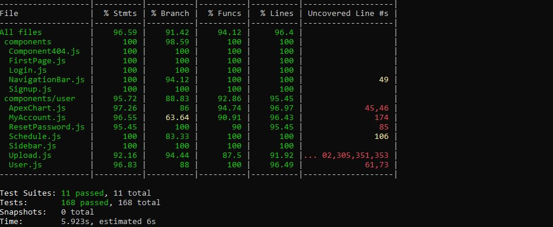
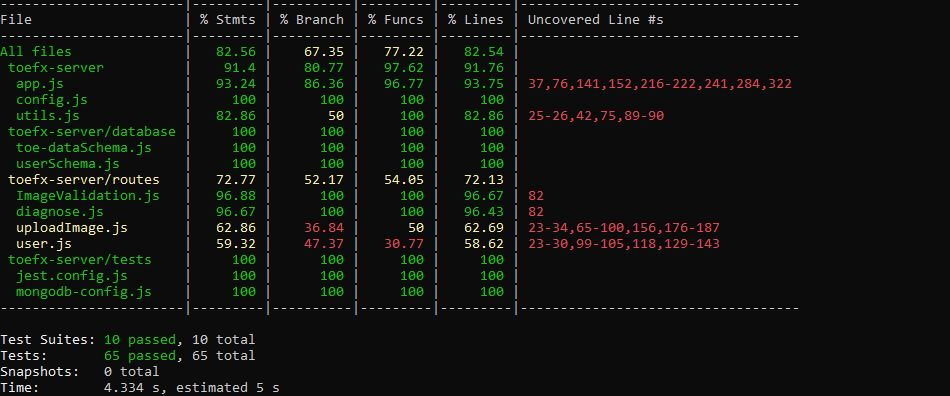
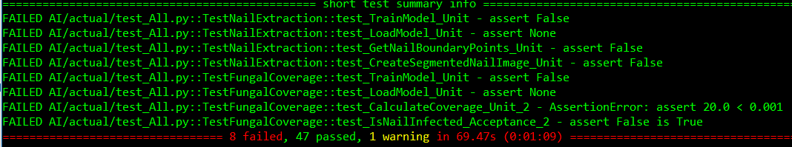
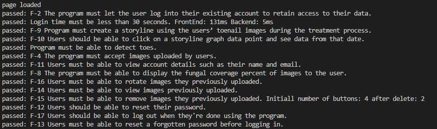
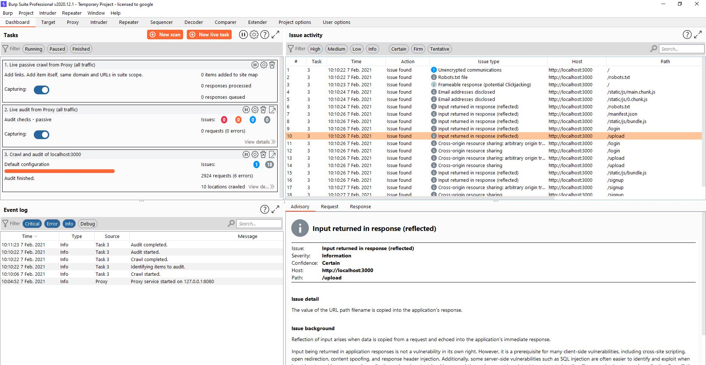

# ToeFX 
#### Update: Instructions for tests and reports added to the bottom.
A web application that helps patients detect fungal toe infection, and allows them to keep track of their treatment progress.

## Requirements:
* [Nodejs (15.5.1)](https://nodejs.org/en/)
* [Python3](https://www.python.org/downloads/)
* Pillow
* [Tensorflow](https://www.tensorflow.org/install/pip)
* [OpenCV](https://pypi.org/project/opencv-python/)
  
Note: Make sure you have python3 alias set as python. Running `python` should open an interactive CI.

**A docker file for running server with AI is in the `toefx-server` folder.**
## Running the Application:
1. Open a terminal.
2. Navigate to the `toefx-client` folder.
3. Install all the required dependencies: 
`Run "npm install"` 
4. Start the front-end server. 
`Run "npm start"`
5. From the root directory (ToeFX), navigate to the `toefx-server` folder.
6. Install all the required dependencies. 
`Run "npm install"`
7. Start the back-end server. 
`Run "npm start"`
8. Open up a web browser and go to http://localhost:3000/
9. Click `Login` at the top of the page. Use the default login username `demo@gmail.com` and the default login password `123` to access the application. 

# Tests (unit-test, validation-test, stress and security test)
**Screenshots are at the bottom.**
* Used **Jest** to test the react app and the node app.
* Created a **bot** for validation and stress test (Some part of the validation test is done using Jest but because of security reasons, react/jest does not allow image upload).
*  Used **Burp suite professional** for security and stress tests.
* Used **pytest --cov** for machine learning tests.

Tests for the React app are in the `toefx-client` -> `src` -> `tests` folder.
Tests for the Node app are in the `toefx-server` -> `tests` folder.
Tests for the AI are in `toefx-server` -> `AI` -> `actual` folder.
Bot tester is in `./testingSelenium`.

## Test reports
* To access the test report generated for the React app, from the root directory, go to `toefx-client` -> `coverage` -> `icov-report` -> `index.html`. 
* To access the test report generated for the Node app, from the root directory, go to `toefx-server` -> `coverage` -> `icov-report` -> `index.html`.
* To access the test report generated by Burp suite, from the root directory, go to `BurpSuite` -> `burp.html` and there is a screen-shot(burp.JPG) showing the number of requests sent.
* To access the test report generated by Pytest, from the root directory, go to `toefx-server` -> `coverage` -> `Pytest-report`.
* to access the test results generated by the Bot, go to `./testingSelenium` -> `SampleRun.PNG`.

## Running the Tests
### Setup
* Make sure you meet the requirements listed above.
* Make sure you have Python Selenium installed.(pip install selenium)
* Go to `toefx-client` and run `npm install`
* Go to `toefx-server` and run `npm install`

### Run
* To run the **unit tests** for the React app, go to `toefx-client` and run `npm run unitTest`.  The output is  a table showing the percentage of statements coverage, branch coverage, function coverage and line coverage.
* To run the **unit-tests** for the node app, go to `toefx-server` and run `npm run unitTest`. The output is  a table showing the percentage of statements coverage, branch coverage, function coverage and line coverage.
* To run the **unit-tests** for the machine learning, go to `toefx-server` and run `pytest --cov`. The output is  a table showing the percentage of statement coverage, as well as tests passed or failed.
* To run the **validation tests** (most of it done by the Bot (see `Instructions for Running the Bot`)), first go to `toefx-server` and run `npm start`. Then go to `toefx-client` and run `npm run validationTest`.

## Instructions for Running the Bot (Continue Validation and Stress Test)
1. Run both frontend and backend: Go to `toefx-client` and run `npm start`, then go to `toefx-server` and run `npm start`.
2. Get the required chromedriver for your OS and put it in `TestingSelenium`. `https://sites.google.com/a/chromium.org/chromedriver/downloads` 
Note: chromedriver.exe is already in the folder `TestingSelenium`. 
3. Go to `TestingSelenium`, run `python ./test.py False` to see the action, or run `python ./test.py False` to run it in headless mode.

#### Images
  
  
  
  
  
